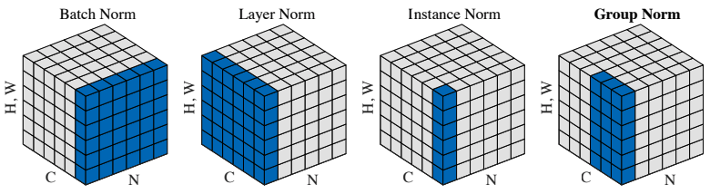
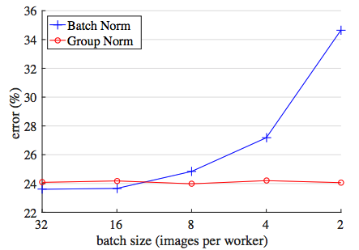
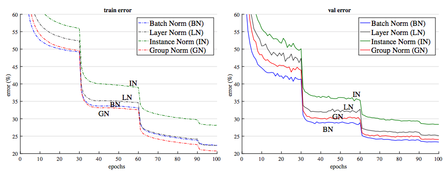
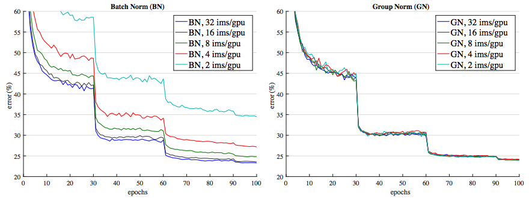
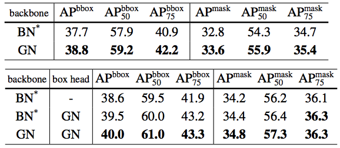

# Group_Normalization-Tensorflow
Simple Tensorflow implementation of [Group Normalization](https://arxiv.org/pdf/1803.08494.pdf)

## USE `tf.contrib.layers.group_norm` !!!

## Code
```python
def group_norm(x, G=32, eps=1e-5, scope='group_norm') :
    with tf.variable_scope(scope) :
        N, H, W, C = x.get_shape().as_list()
        G = min(G, C)

        x = tf.reshape(x, [N, H, W, G, C // G])
        mean, var = tf.nn.moments(x, [1, 2, 4], keep_dims=True)
        x = (x - mean) / tf.sqrt(var + eps)

        gamma = tf.get_variable('gamma', [1, 1, 1, C], initializer=tf.constant_initializer(1.0))
        beta = tf.get_variable('beta', [1, 1, 1, C], initializer=tf.constant_initializer(0.0))


        x = tf.reshape(x, [N, H, W, C]) * gamma + beta

    return x
```

## Usage
```python
from ops import *
  x = conv(x)
  x = group_norm(x) 
```

## Normalization function


## ImageNet Results
### classification error per batch sizes


### Comparison of error curves with a batch size of 32 (ResNet 50)


### Sensitivity to batch sizes (ResNet 50)


## COCO Results


## Related works
* [Spectral Normalization-Tensorflow](https://github.com/taki0112/Spectral_Normalization-Tensorflow)

## Author
Junho Kim
